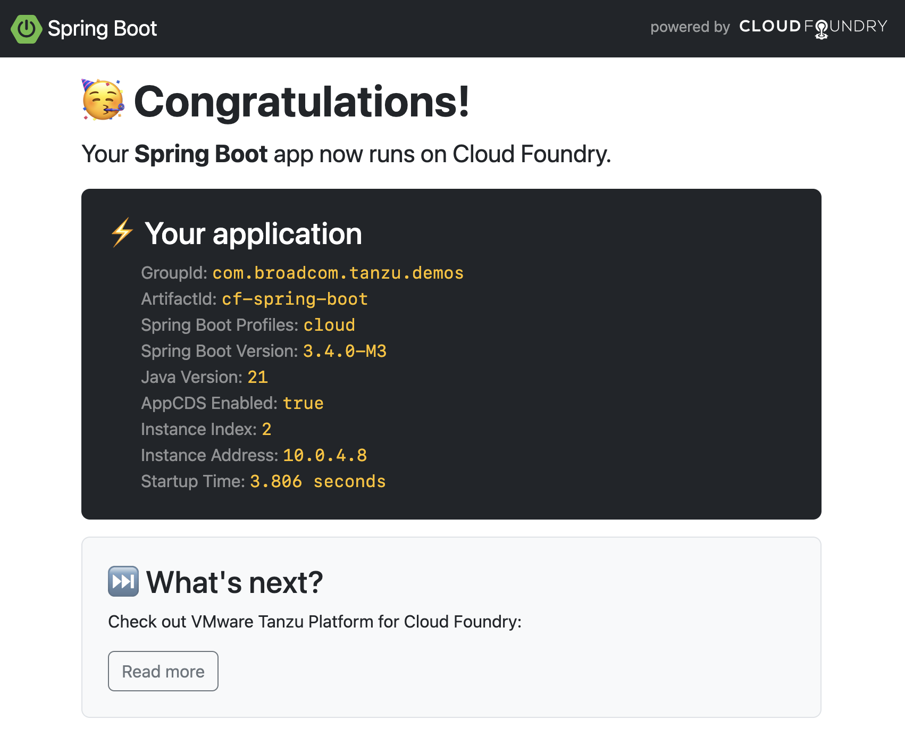

# Running Spring Boot on Cloud Foundry

This project shows how to run a Spring Boot app on Cloud Foundry.



Run this command to build the app (please note you need JDK 21+):

```shell
./mvnw clean package
```

No need to worry about Dockerfiles and a wall of YAML, the only thing you need to deploy
apps on Cloud Foundry is a single command:

```shell
cf push
```

That's it!

Please note that this Spring Boot app leverages
[AppCDS](https://docs.oracle.com/en/java/javase/21/vm/class-data-sharing.html)
to speed up startup time. The Java Buildpack actually takes care of creating a CDS archive for you.
See the [app manifest](manifest.yaml) for details.

## Contributing

Contributions are always welcome!

Feel free to open issues & send PR.

## License

Copyright &copy; 2024 [Broadcom, Inc. or its affiliates](https://vmware.com).

This project is licensed under the [Apache Software License version 2.0](https://www.apache.org/licenses/LICENSE-2.0).
